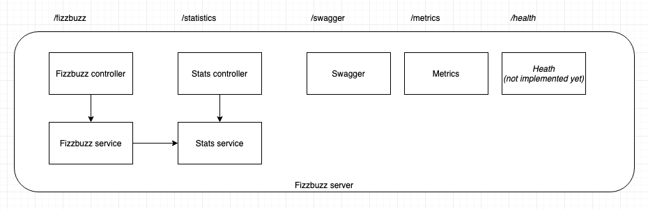

# Fizzbuzz sandbox test
## Goal

The original fizz-buzz consists in writing all numbers from 1 to 100, and just replacing all multiples of 3 by "fizz", all multiples of 5 by "buzz", and all multiples of 15 by "fizzbuzz". The output would look like this: "1,2,fizz,4,buzz,fizz,7,8,fizz,buzz,11,fizz,13,14,fizzbuzz,16,...".

Your goal is to implement a web server that will expose a REST API endpoint that:

Accepts five parameters : three integers int1, int2 and limit, and two strings str1 and str2.

Returns a list of strings with numbers from 1 to limit, where: all multiples of int1 are replaced by str1, all multiples of int2 are replaced by str2, all multiples of int1 and int2 are replaced by str1str2.

The server needs to be:

 - Ready for production
 - Easy to maintain by other developers 

Add a statistics endpoint allowing users to know what the most frequent request has been.
This endpoint should:

- Accept no parameter
- Return the parameters corresponding to the most used request, as well as the number of hits for this request

## Usage

The project can be launched in standalone mode (via npm and local install), or via docker.

## Standalone mode

### Prerequise

`nodejs` runtime `14.17` or later.

### Installation

```bash
$ npm install
```

### Running the app

```bash
# development
$ npm run start

# watch mode
$ npm run start:dev

# production mode
$ npm run start:prod
```

### Test

```bash
# unit tests
$ npm run test

# e2e tests
$ npm run test:e2e

# test coverage
$ npm run test:cov
```

## Docker

### Prerequisite

Docker installed on the local environment.

### Launching the stack
Run the following script (no Windows version, sorry):
```shell
./start-stack.sh
```
It will install node modules locally and launch the stack via a `docker-compose`.

### Stack overview
- Api server: `http://localhost:3000/swagger`
- {WIP} Grafana: `http://localhost:9990/`
- {WIP} Prometheus: `http://localhost:/9991`

## Stay in touch

- Author - Guillaume GIRARD

## License

Nest is [MIT licensed](LICENSE).

## Benchmark

### Performance testing
Simple `ab` script is available :
```shell
./benchmark/ab.sh
```

### Load testing
`k6s` script in WIP.

## Current implementation

This project has been implemented with NestJS, version 8.01.\
The current implementation is "naive" architecture wise.\
Controllers are lightweight and only pass on the workload to dedicated services.



A swagger is available on `/swagger`.

A Prometheus module has been added to provide monitoring (during the loadtest). 

## CI
Using Github actions from the marketplace:
- [Coverage report action](https://github.com/ArtiomTr/jest-coverage-report-action)
- [Docker build push action](https://github.com/docker/build-push-action)


## TODO
- done: ~~Implement fizzbuzz controller~~
- done: ~~Implement fizzbuzz service tests~~
- done: ~~Implement fizzbuzz service~~
- done: ~~Add swagger~~
- done: ~~Implement stat controller~~
- done: ~~Implement stat service tests~~
- done: ~~Implement stat service~~
- done: ~~Dockerize build~~
- done: ~~Setup CI, run build and tests~~
- Implement e2e testing / controller testing
- Add env configuration
- done: ~~Add code coverage report~~
- done: ~~Add benchmark capabilities~~
- Cap stat service size to avoid memory leak
- Refact DTO / modules to better stick a pertinent architecture
- Add load testing capabilities
- Add redis as an optional stat service
- Add selfsigned certificates
- Add cors whitelist
- Security: best practise pass
- Add release workflow
- Deploy

## Improvements / Nice to have
- Split the fizzbuzz DTO, one for the controller validation, the other to be used in the service / rest of the app.
- Perf: optimise the fizzbuzz string concatenation

## Considerations / Discussions

We do not check if the integer is larger than the limit (ex: integer1 = 50, limit = 10).
  - In this case, the program still works, though the numbers will not be replaced. 

Validation is duplicated with the Nest validation pipes and in the validation function in the service
  - We could argue that this is still useful if we add another way to invoke the service (via messaging for example)
  - This allows the controller to respond quickly with the proper status code
  - Though the business rules are still duplicated

